# **Devops project CRONIER DUCASTEL**

## **1. Create a web application**

It is a basic NodeJS web application exposing REST API that creates and stores user parameters in [Redis database](https://redis.io/).

### **Functionality**

1. Start a web server
2. Create a user

### **Installation**

This application is written on NodeJS and it uses Redis database.

1. [Install NodeJS](https://nodejs.org/en/download/)

2. [Install Redis](https://redis.io/download)

3. Install application

Go to the root directory of the application (where `package.json` file located) and run:

```
npm install 
```

### **Usage**

1. Start a web server

From the root directory of the project run:

```
npm start
```

It will start a web server available in your browser at http://localhost:3000.

2. Create a user

Send a POST (REST protocol) request using terminal:

```bash
curl --header "Content-Type: application/json" \
  --request POST \
  --data '{"username":"sergkudinov","firstname":"sergei","lastname":"kudinov"}' \
  http://localhost:3000/user
```

It will output:

```
{"status":"success","msg":"OK"}
```

Another way to test your REST API is to use [Postman](https://www.postman.com/).

### **Testing**

From the root directory of the project, you can run some tests with the following command :

```
npm test
```
You must run this command in an other terminal before, otherwise the tests won't be valid.
```
redis-server
```
You obtain the following result :

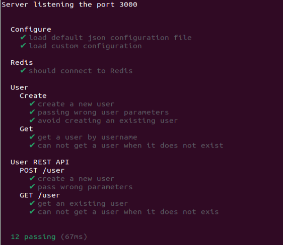

## **2. Apply CI/CD pipeline**

We create a CI and CD workflow using this main.yml files : 
```yaml
name: Node.js CI

on:
  push:
    branches: [ main ]
  pull_request:
    branches: [ main ]

jobs:
  build:

    runs-on: ubuntu-latest
    defaults:
      run:
        working-directory: userapi

    strategy:
      matrix:
        node-version: [10.x, 12.x, 14.x, 15.x]
        redis-version: [4, 5, 6]
        
    steps:
    - name: Git checkout
      uses: actions/checkout@v2

    - name: Use Node.js ${{ matrix.node-version }}
      uses: actions/setup-node@v1
      with:
        node-version: ${{ matrix.node-version }}

    - name: Start Redis
      uses: supercharge/redis-github-action@1.4.0
      with:
        redis-version: ${{ matrix.redis-version }}

    - run: npm install
    - run: npm test

  deploy:
      
      needs: build
      runs-on: ubuntu-latest

      steps:
        - uses: actions/checkout@v2
        - uses: akhileshns/heroku-deploy@v3.12.12 # This is the action
          with:
            appdir: userapi 
            heroku_api_key: "9388eb37-448d-4e66-ada3-b5fedb9109a5"
            heroku_app_name: "devopscronierducastel" #Must be unique in Heroku
            heroku_email: "timotheecronier@gmail.com"   
```

We check this with tests via GitHub Actions, on which implemented our continuous integration workflow : 

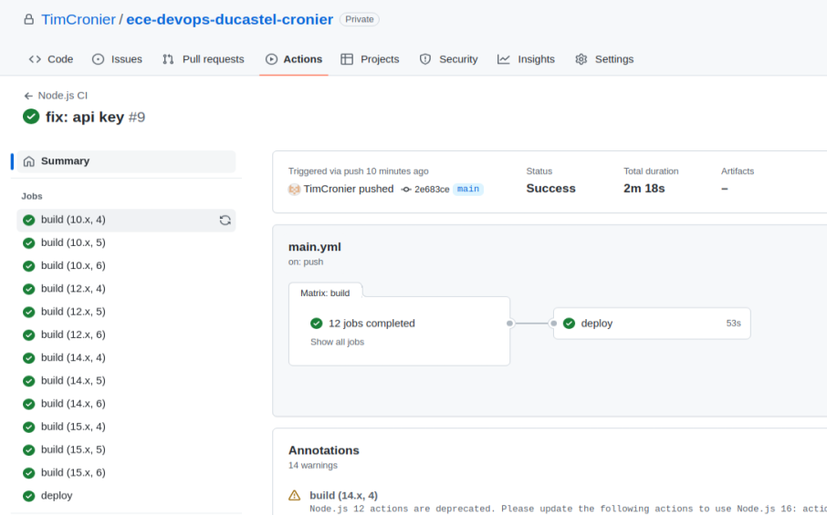

Finally, we can deploy with [Heroku](https://www.heroku.com/) and we can access the deployment of our project:

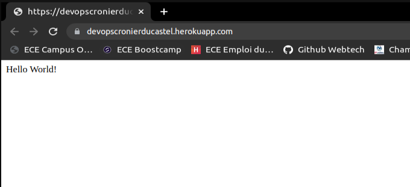
 
<br><br>

## **3. Configure and provision a virtual environment and run your application using the IaC approach**

> **_NOTE:_**  Unfortunately, due to an error using that we couldn't manage to fix (the vboxsf type of file cannot be read in our VM), we had to do this part of the project with the lab, not Redis and Userapi.

### **Installation**

- Install [VirtualBox](https://www.virtualbox.org/wiki/Downloads)
- Install [Vagrant](https://developer.hashicorp.com/vagrant/downloads)

<br>

### **Part 1. Imperative - Using Vagrant with Shell Provisioner**

#### *1. Create a virtual machine (VM)*

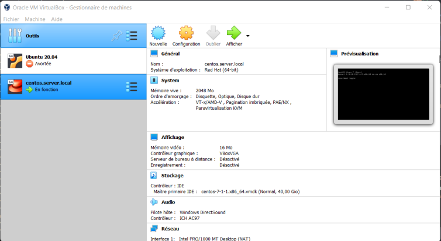

Run the command to create the VM:
```
vagrant up
```
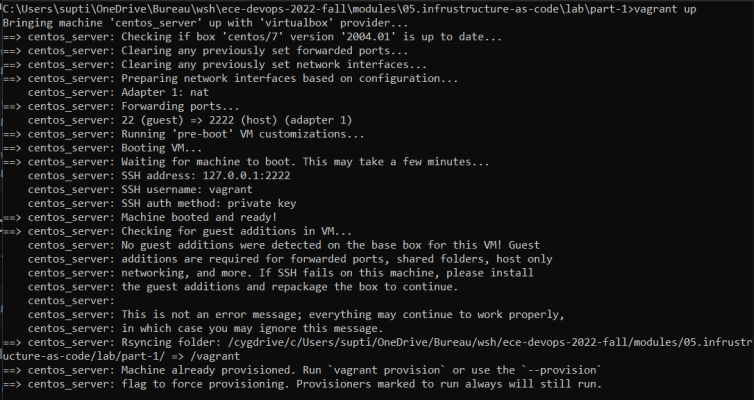

#### *2. Check that everything is ok by connecting to the VM with SSH*

We can then enter the VM shell using this command :
```
vagrant ssh
```
#### *3. Play with different commands for Shell Provisioner*

Before the first modification of the VagrantFile we got:

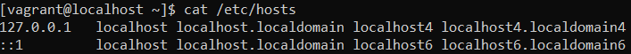

After that we modify the VagrantFile a first time:

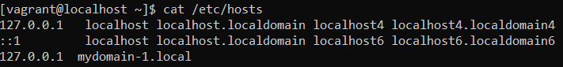

And a second time:

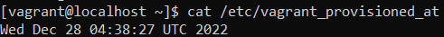

### **Part 2. Declarative - GitLab installation using Vagrant and Ansible Provisioner**
When we test the installation, the connexion at the http://localhost:8080 display a GitLab page

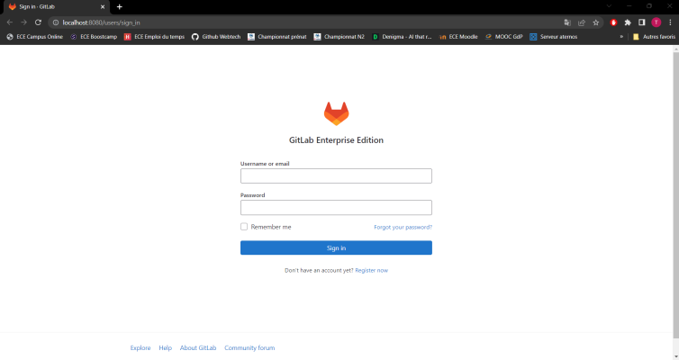

The password is available with the following command :
```
sudo cat /etc/gitlab/initial_root_password
```


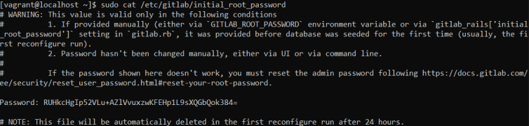

### **Part 3. Declarative - Configure a health check for GitLab**
<br>

The first health test : 

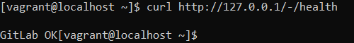

After that we replace 'TAG' by 'check' and run the following command and everything is fine:

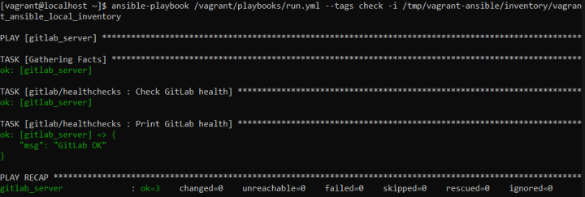

We add readiness check and liveness check:

```yml
- name: Check GitLab health
  uri:
    url: http://127.0.0.1/-/health
    return_content: yes
  # Register the output of the module in a variable
  register: gitlab_health


- name: Print GitLab health
  debug:
    msg: "{{ gitlab_health.content }}"

# Run the 2 other kind of health checks below

- name: Check GitLab readiness
  uri:
    url: http://127.0.0.1/-/readiness
    return_content: yes
  # Register the output of the module in a variable
  register: gitlab_readiness

- name: Print GitLab readiness
  debug:
    msg: "{{ gitlab_readiness.content }}"


- name: Check GitLab liveness
  uri:
    url: http://127.0.0.1/-/liveness
    return_content: yes
  # Register the output of the module in a variable
  register: gitlab_liveness

- name: Print GitLab liveness
  debug:
    msg: "{{ gitlab_liveness.content }}"

```

We check that all is OK:

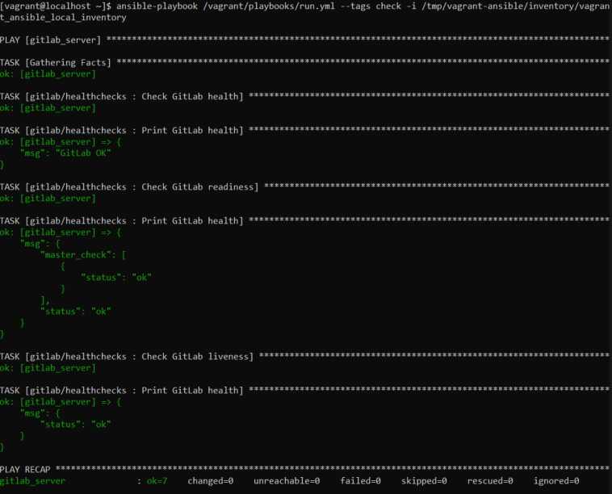

## **4. Build Docker image of your application**

### **Installation**

Install [Docker Desktop](https://www.docker.com/get-started/)

### **1. Create a Docker image of your application**

We create an image of our application:

 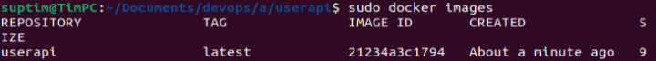

 ### **2. Push the image to Docker Hub**

 We push the image on docker:

 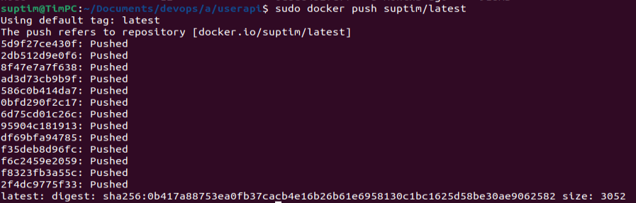

 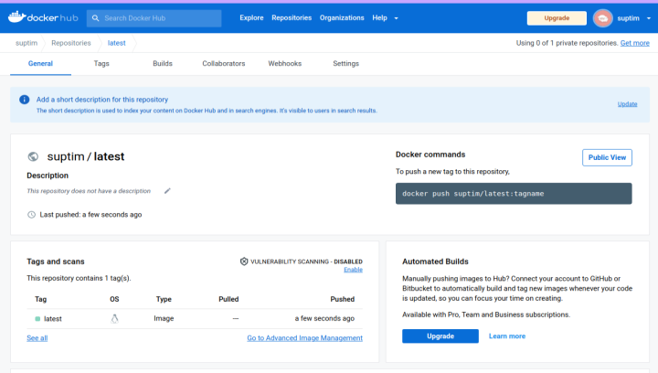

 ## **5. Make container orchestration using Docker Compose**

We create a [docker-compose.yaml](docker-compose.yaml) file that will start our application.

Then we run : 
```
docker-compose up
```
We can see at http://localhost:3000 that our application is running.

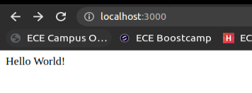

## **6. Make docker orchestration using Kubernetes**

### **Install Minikube**

Install [Minikube](https://minikube.sigs.k8s.io/docs/start/)

- Start Minikube

```
minikube start
```
- Check that everything is OK

```
minikube status
```
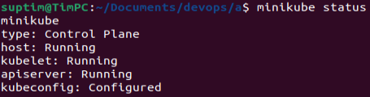

### **Running the Kubernetes deployments**

- Go to the [/k8s](k8s) directory and run this command for every file:
```
kubectl apply -f <file_name.yaml>
```
- The deployment.yaml file describes the desired states of the redis and userapi deployments.
- The service.yaml file exposes the redis and userapi apps as network services and * gives them the right ports.
- The persistentvolume.yaml file creates a piece of storage in the cluster which has a lifecycle independent of any individual Pod that uses the PersistentVolume.
- The persistentvolumeclaim.yaml file create a request for storage by a user.

### **Check that everything is running**

- Check that the deployments are running:

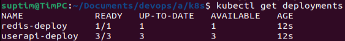

- Check that the services are running:

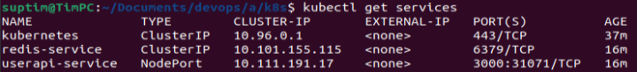

- Check that the PersistentVolume is running:

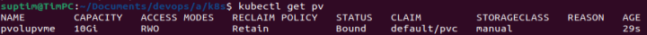

- Check that the PersistentVolumeClaim is running:

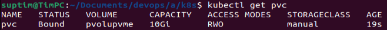

- Check the pods:

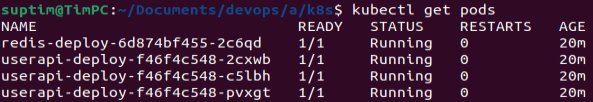

- You can also check this on the minikube dashboard with:
```
minikube dashboard
```

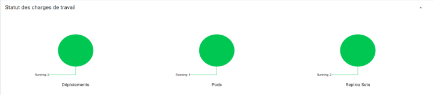

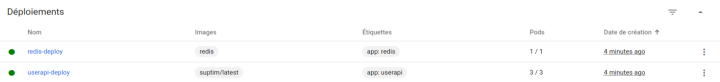

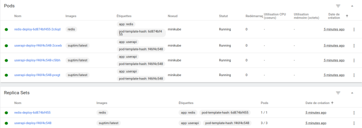

## **Author**

*Tim Cronier tim.cronier@edu.ece.fr*  <br>
*Julien Ducastel julien.ducastel@edu.ece.fr*

