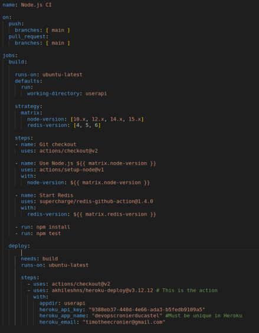

# **Devops project CRONIER DUCASTEL**

## **1. Create a web application**

It is a basic NodeJS web application exposing REST API that creates and stores user parameters in [Redis database](https://redis.io/).

### **Functionality**

1. Start a web server
2. Create a user

### **Installation**

This application is written on NodeJS and it uses Redis database.

1. [Install NodeJS](https://nodejs.org/en/download/)

2. [Install Redis](https://redis.io/download)

3. Install application

Go to the root directory of the application (where `package.json` file located) and run:

```
npm install 
```

### **Usage**

1. Start a web server

From the root directory of the project run:

```
npm start
```

It will start a web server available in your browser at http://localhost:3000.

2. Create a user

Send a POST (REST protocol) request using terminal:

```bash
curl --header "Content-Type: application/json" \
  --request POST \
  --data '{"username":"sergkudinov","firstname":"sergei","lastname":"kudinov"}' \
  http://localhost:3000/user
```

It will output:

```
{"status":"success","msg":"OK"}
```

Another way to test your REST API is to use [Postman](https://www.postman.com/).

### **Testing**

From the root directory of the project, run:

```
npm test
```


## **2. Apply CI/CD pipeline**

We create a CI and CD workflow using this main.yml files : 



We check this with tests : 


After that we deploy with Heroku and we can access the deployment of our project:


## **3. Configure and provision a virtual environment and run your application using the IaC approach**

### **Part 1. Imperative - Using Vagrant with Shell Provisioner**

#### *1. Create a virtual machine (VM)*


Run the command:
```
vagrant up
```


#### *2. Check that everything is ok by connecting to the VM via SSH*

To enter inside the VM via SSH:
```
vagrant ssh
```
#### *3. Play with different commands for Shell Provisioner*

Before the first modification of the VagrantFile we got:


After that we modify the VagrantFile a first time:


And a second time:


### **Part 2. Declarative - GitLab installation using Vagrant and Ansible Provisioner**
When we test the installation, the connexion at the http://localhost:8080 display a GitLab page


To find the password:


### **Part 3. Declarative - Configure a health check for GitLab**

The health is OK:


After that we replace 'TAG' by 'check' and run the following command and everything is fine:


We add readiness check and liveness check:

```yml
- name: Check GitLab health
  uri:
    url: http://127.0.0.1/-/health
    return_content: yes
  # Register the output of the module in a variable
  register: gitlab_health


- name: Print GitLab health
  debug:
    msg: "{{ gitlab_health.content }}"

# Run the 2 other kind of health checks below

- name: Check GitLab readiness
  uri:
    url: http://127.0.0.1/-/readiness
    return_content: yes
  # Register the output of the module in a variable
  register: gitlab_readiness

- name: Print GitLab readiness
  debug:
    msg: "{{ gitlab_readiness.content }}"


- name: Check GitLab liveness
  uri:
    url: http://127.0.0.1/-/liveness
    return_content: yes
  # Register the output of the module in a variable
  register: gitlab_liveness

- name: Print GitLab liveness
  debug:
    msg: "{{ gitlab_liveness.content }}"

```

All is good:


## **4. Build Docker image of your application**

### **1. Create a Docker image of your application**

We create an image of our application:

 

 ### **2. Push the image to Docker Hub**

 We push the image on docker:

 

 

 ## **5. Make container orchestration using Docker Compose**

We create a docker-compose.yaml file that will start our application

After we run 
```
docker-compose up
```
We can see http://localhost:3000 
## **Author**

*Tim Cronier tim.cronier@edu.ece.fr*
*Julien Ducastel julien.ducastel@edu.ece.fr*

